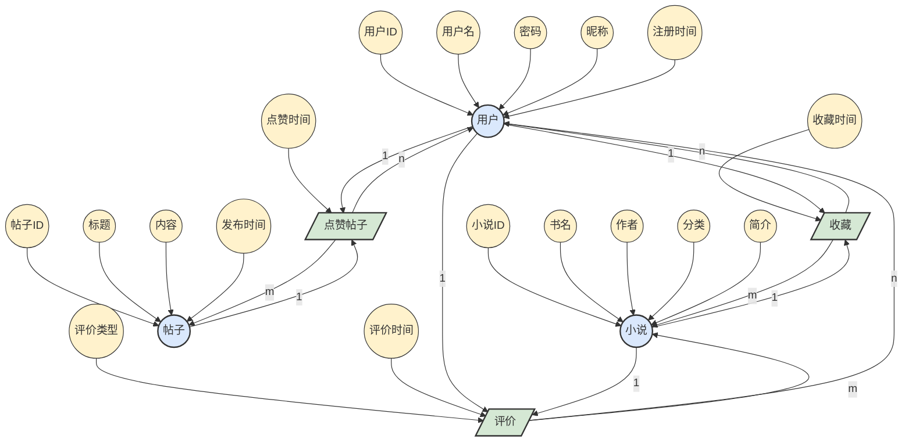

```mermaid
flowchart TD
    %% 定义样式（可选）
    classDef entity fill:#dae8fc,stroke:#333,stroke-width:2px;
    classDef attr fill:#fff2cc,stroke:#333,stroke-width:1px;
    classDef relation fill:#d5e8d4,stroke:#333,stroke-width:2px;

    %% ----- 实体（矩形）-----
    user(("用户")):::entity
    novel(("小说")):::entity
    post(("帖子")):::entity

    %% ----- 属性（椭圆）-----
    user_id(("用户ID")):::attr
    username(("用户名")):::attr
    password(("密码")):::attr
    nickname(("昵称")):::attr
    regtime(("注册时间")):::attr

    novel_id(("小说ID")):::attr
    title(("书名")):::attr
    author(("作者")):::attr
    category(("分类")):::attr
    description(("简介")):::attr

    post_id(("帖子ID")):::attr
    post_title(("标题")):::attr
    content(("内容")):::attr
    post_time(("发布时间")):::attr

    %% 关系的属性
    collect_time(("收藏时间")):::attr
    rate_type(("评价类型")):::attr
    rate_time(("评价时间")):::attr
    like_time(("点赞时间")):::attr

    %% ----- 关系（菱形）-----
    collect[/"收藏"/]:::relation
    rate[/"评价"/]:::relation
    post_like[/"点赞帖子"/]:::relation

    %% ----- 属性连接到实体（省略简单连线，仅示意，实际布局需手动调整）-----
    user_id --> user
    username --> user
    password --> user
    nickname --> user
    regtime --> user

    novel_id --> novel
    title --> novel
    author --> novel
    category --> novel
    description --> novel

    post_id --> post
    post_title --> post
    content --> post
    post_time --> post

    collect_time --> collect
    rate_type --> rate
    rate_time --> rate
    like_time --> post_like

    %% ----- 实体与关系的连线（标注多重性）-----
    %% 用户 - 收藏 - 小说（多对多）
    user -- "1" --> collect
    collect -- "n" --> user
    novel -- "1" --> collect
    collect -- "m" --> novel

    %% 用户 - 评价 - 小说（多对多）
    user -- "1" --> rate
    rate -- "n" --> user
    novel -- "1" --> rate
    rate -- "m" --> novel

    %% 用户 - 点赞帖子 - 帖子（多对多）
    user -- "1" --> post_like
    post_like -- "n" --> user
    post -- "1" --> post_like
    post_like -- "m" --> post
```